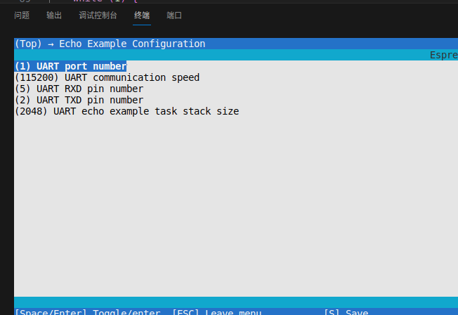

> git status //状态查看
> git add . //追踪
> git config -l //配置查看
> git config --unset XXX //取消某些配置
> git commit -m "xxx" // 提交
> git push -u 名称 分支 //上传
> git log --oneline --decorate --graph --all //查看分支结构
> git branch -d xxx //删除本地分支
> git checkout xxx //切换分支
> git checkout -b xxx //新建本地分支
> git merge --no-ff xxx //不采用快照ff模式，合并到xxx位置
> git pull --rebase //将远端仓库的修改和本地的修改进行合并形成最新的提交
> git push origin xxx //建好本地分支后，在输入该指令建立远程分支
> git push origin ：xxx //删除远程分支但是不会删除本地分支
>
> # 1.启动clash翻墙
>
> 在.config/mihomo 文件夹中启动
> ./clash-linux
>
> # 2.打开火狐
>
> 在命令行输入
> firefoxS
>
> # 3.安装pycharm
>
> ```
> sudo snap install pycharm-community --classic
> 在应用程序菜单找到pycharm并打开
> ```
>
> 命令行:
>
> ```
> . $HOME/esp/esp-idf/export.sh
> idf.py set-target esp32s3
> idf.py menuconfig
> idf.py build
> sudo chmod 777 /dev/ttyUSB0 
> idf.py -p /dev/ttyUSB0 flash
> idf.py -p /dev/ttyUSB0 monitor
> ```

# 0问题：

## 1.开发ESP32时设置环境变量问题

> 使用esp-idf 开发例程时,设置环境变量时出现问题,命令行输入
>
> ```
> . $HOME/esp32c3/esp-idf/export.sh
> ```
>
>
> 报错:
>
> ERROR: tool riscv32-esp-elf-gdb has no installed versions. Please run '/usr/bin/python3 /home/mw/esp32/esp-idf/tools/idf_tools.py install' to install it.
> Using a supported version of tool cmake found in PATH: 3.16.3.
> However the recommended version is 3.24.0.
>
> 解决方式:
>
> 1.删除原来的程序,重新编译新的例程,还是报错.(不行)
>
> 2.重新开一个新的虚拟机镜像,再运行例程就好了.(已解决)

## 2.虚拟机里的ubuntu系统内存不足问题

> 在新建ubuntu系统时，只分配了20G的系统内存，在开发过程中，随着开发内容增多，内存提示不够。
>
> 输出命令可以看到内存使用情况：
>
> ```
> df -h
> ```
>
> 

### 1.虚拟机扩容


### 2.使用命令安装分区管理工具gparted:

> ```
> sudo apt-get install gparted
> ```
>
> 使用命令启动分区管理工具
>
> ```
> sudo gparted
> ```


### 3.设置应用完成


## 3.ubunbu 安装搜狗输入法安装成功后，可以调出来，但是还是不能输入中文

> 解决方式


2.开启开机是激活键盘输入法

0.1知识点：

题目：假如串口通讯可以接收39个数据，怎样让每输出10个数据就进行一次换行，包括第一个数据。

答案：

```c
for (int i = 0; i < len; i++) {
    printf("0x%.2x ", data[i]);  
    // 每输出10个数据换行，包括第一个数据
    if ((i + 1) % 10 == 0) {
        printf("\r\n");
    }
}
```

# 1.ESP32开发环境搭建

## 1.安装虚拟机

> VMware虚拟机下载网址
>
> ```
> https://www.vmware.com/products/workstation-pro.html
> ```
>
> 虚拟机版本：VMware® Workstation 17 Pro （17.5.1 build-23298084）


## 2.安装ubuntu 20.04.6

### 1.网站下载镜像包

```
https://mirrors.tuna.tsinghua.edu.cn/ubuntu-releases/20.04/
```


### 2.安装VMware tools

```
sudo apt-get upgrade //升级所有可升级的软件包
apt list //列出包含条件的包（已安装，可升级等）

tar -zxvf VMwareTools-10.3.22-15902021.tar.gz
cd vmware-tools-distrib
sudo ./vmware-install.pl
执行安装，输入yes，路径默认
```


### 3.实现文件夹互拖动

```
sudo apt-get autoremove open-vm-tools
sudo apt-get install open-vm-tools-desktop
sudo reboot
```

## 3.打开安装打开vscode

### 1.下载

直接通过软件下载或者命令行下载

```
sudo apt update 
sudo apt install code
```

### 2.启动

安装完成后，通过输入以下命令来启动VS Code：

```
code 
```

## 4.ubuntu安装esp32开发环境

### 1.安装python版本

```
python --version
Python 3.8.10
```

### 2.获取ESP-IDF

获取 ESP-IDF 的本地副本：打开终端，切换到要保存 ESP-IDF 的工作目录，使用 `git clone` 命令克隆远程仓库

安装准备

```
sudo apt-get install git wget flex bison gperf python3 python3-pip python3-venv cmake ninja-build ccache libffi-dev libssl-dev dfu-util libusb-1.0-0
```

```bash
mkdir -p ~/esp
cd ~/esp
git clone --recursive https://github.com/espressif/esp-idf.git
```

### 3.设置工具

除了 ESP-IDF 本身，还需要为支持 ESP32-S3 的项目安装 ESP-IDF 使用的各种工具

```
cd ~/esp/esp-idf
./install.sh esp32s3
```

上述命令仅仅为 ESP32-S3 安装所需工具。如果需要为多个目标芯片开发项目，则可以一次性指定多个目标，如下所示：

```
cd ~/esp/esp-idf
./install.sh esp32,esp32s2
```

如果需要一次性为所有支持的目标芯片安装工具

```
cd ~/esp/esp-idf
./install.sh all
```

**问题：** 在安装git仓库里的文件时下载太慢。

### 4.设置环境变量

```
. $HOME/esp/esp-idf/export.sh
```

### 5.移动例程到目标文件夹

```
cd ~/esp32
cp -r $IDF_PATH/examples/get-started/hello_world .
```

### 6.连接设备

命令行输入查看串口号

```
ls /dev/tty*
```


>问题：
>
>Error: Invalid value for '-p' / '--port': Path '/dev/ttyUSB0' is not readable.
>查看是否给串口权限了
>
>```
>sudo chmod 777 /dev/ttyUSB0 
>```

## 5.win10安装esp32开发环境

### 1.网站链接

```
https://dl.espressif.cn/dl/esp-idf/?idf=4.4
```


下载安装包直接运行：

```
espressif-ide-setup-2.12.0-with-esp-idf-5.1.2.exe
```

安装程序会安装以下组件：

- 内置的 Python
- 交叉编译器
- OpenOCD
- [CMake](https://cmake.org/download/) 和 [Ninja](https://ninja-build.org/) 编译工具
- ESP-IDF

### 2.开始创建工程

将 [get-started/hello_world](https://github.com/espressif/esp-idf/tree/8e863fa/examples/get-started/hello_world) 工程复制至本地的 `~/esp` 目录下

```
~/esp 为下载安装目录根据下载目录而定 我的是 C:\Espressif\frameworks
```


### 3.win10 下载命令

```
cd %userprofile%\esp\hello_world
idf.py set-target esp32s3
idf.py menuconfig
idf.py build
idf.py -p COM3 -b 115200 flash
```


### 3.监视输出

```
idf.py -p COM3 monitor
```


使用快捷键 `Ctrl+]`，可退出 ESP-IDF 监视器

改文件后再次编译命令

```
idf.py build
idf.py -p COM3 -b 115200 flash
```

## 6.ubuntu20.04+VScode+ESP32IDF+PlatformIO搭建开发环境

### 1.在VScode中安装插件

```
1)、 C/C++，这个肯定是必须的。
2)、 C/C++ Snippets，即 C/C++重用代码块。
3)、 C/C++ Advanced Lint,即 C/C++静态检测 。
4)、 Code Runner，即代码运行。
5)、 Include AutoComplete，即自动头文件包含。
6 、 Rainbow Brackets，彩虹花括号，有助于阅读代码。
7)、 One Dark Pro VSCode的主题。
8)、 GBKtoUTF8，将 GBK转换为 UTF8。
9 、 ARM，即支持 ARM汇编语法高亮显示。
10)、 Chinese(Simplified)，即中文环境。
11)、 vscode-icons VSCode图标插件，主要是资源管理器下各个文件夹的图标。
12)、 compareit，比较插件，可以用于比较两个文件的差异。
13)、 DeviceTree，设备树语法插件。
14)、 TabNine，一款 AI自动补全 插件
```

### 2.配置ese32 idf 


配置成功后界面

# 3.ESP32 外设测试

## 1.延时测试

命令行

```bash
. $HOME/esp32/esp-idf/export.sh
idf.py set-target esp32s3
idf.py menuconfig
idf.py menuconfig
idf.py build
sudo chmod 777 /dev/ttyUSB0 
idf.py -p /dev/ttyUSB0 flash
idf.py -p /dev/ttyUSB0 monitor
ls /dev/tty*
idf.py fullclean
Python 3.8.10
```


## 2.freertos测试

### 1.esp32内核跑的是freertos 

esp32的启动过程

esp32的启动分为三个步骤： 一级引导，二级引导，主程序运行

一级引导程序

1.被固化在了 ESP32 内部的 ROM 中，它会从 flash 的 0x1000 偏移地址处加载二级引导程序至 RAM (IRAM & DRAM) 中

二级引导程序

当一级引导程序校验并加载完二级引导程序后，它会从二进制镜像的头部找到二级引导程序的入口点，并跳转过去运行。在 ESP-IDF 中，存放在 flash 的 0x1000 偏移地址处的二进制镜像就是二级引导程序。二级引导程序的源码可以在 ESP-IDF 的 components/bootloader 目录下找到

二级引导程序作用：从 flash 中加载分区表和主程序镜像至内存中，主程序中包含了 RAM 段和通过 flash 高速缓存映射的只读段。
二级引导程序默认从 flash 的 0x8000 偏移地址处（可配置的值）读取分区表。请参考 分区表 获取详细信息。引导程序会寻找工厂分区和 OTA 应用程序分区。如果在分区表中找到了 OTA 应用程序分区，引导程序将查询 otadata 分区以确定应引导哪个分区
主程序运行

### 2.freertos的主要文件

|   **文件名**   | **说明**                                                     |
| :------------: | :----------------------------------------------------------- |
|     task.c     | 任务相关的库文件，完成任务的操作的函数集                     |
|     list.c     | 链表操作相关的库文件，链表是FreeRTOS里重要的数据结构，相应的操作函数在这个库里 |
|    queue.c     | 队列和信号量相关的库文件。实现队列与信号量的操作函数         |
|    timers.c    | 软件定时器相关的库文件。                                     |
| event_groups.c | 事件组相关的库文件。                                         |

常用函数的用法

#### 2.1vTaskDelay()

函数原型：void vTaskDelay(const TickType_t xTicksToDelay)

功能：延时指定的时间。

参数：

例子：

    vTaskDelay(1000 / portTICK_PERIOD_MS); // 定时1s
    vTaskDelay(100 / portTICK_PERIOD_MS); // 定时100ms

## 3.按键检测测试

```
#include <stdio.h>
#include "freertos/FreeRTOS.h"
#include "freertos/task.h"
#include "driver/gpio.h"


void key_init(void)
{
    gpio_config_t io_conf;
    io_conf.intr_type = GPIO_INTR_POSEDGE;
    io_conf.pin_bit_mask = 1<<0;
    io_conf.mode = GPIO_MODE_INPUT;
    io_conf.pull_up_en = 1;
    gpio_config(&io_conf);
}


void app_main(void)
{
    int cnt = 0;

    key_init();

    while(1){
        printf("2cnt:%d\n", cnt++);
        if (gpio_get_level(0) == 0) {
            printf("cnt:%d\n", cnt++);
        }
        vTaskDelay(50);
        // vTaskDelay(1000 / portTICK_PERIOD_MS); // 定时1s
        // vTaskDelay(100 / portTICK_PERIOD_MS); // 定时100ms
    }

}
```


## 4.灯测试程序

详细程序看02ANT200


## 5.使用VSCode与PlatformIO平台开发ESP32

1.安装vscode 

2.安装platformio插件


3.如果新建文件太慢可以先将platformio离线文件部署到根目录


```
https://pan.baidu.com/share/init?surl=TTLrAeoe2mtnN06FumNWbg&pwd=8888
```

# 4..ESP32C3跑通以太网测试

## 1.模块实物图：WT32C3-S5


## 2.原理图：


## 3.接线原理：

```
1.串口调试接线
WT32C3-S5 ------ 串口六合一模块 
C3_TX0    ------   RXD
C3_RX0    ------   TXD
GND       ------   GND
3.3V      ------   3.3V
2.下载接线
2.1下载模式：
C3_IO9    ------ GND
ESP_EN    ------ GND
步骤：命令行键入idf.py -p /dev/ttyUSB0 flash
	到串口烧录等待界面，将C3_IO9接GND 再将ESP_EN接GND短暂接触后断开接地，使板子复位到下载模式boot
2.2调试模式：
步骤：命令行键入idf.py -p /dev/ttyUSB0 monitor,将C3_IO9接浮空，再将ESP_EN接GND短暂接触后断开接地，使板子复位
```


## 4.程序源码：

跑esp32-idf 官方例程，源码路径：~/esp32c3/esp-idf/examples/ethernet/basic

命令行运行：

```
. $HOME/esp32c3/esp-idf/export.sh
idf.py set-target esp32c3
idf.py menuconfig
idf.py build
sudo chmod 777 /dev/ttyUSB0 
idf.py -p /dev/ttyUSB0 flash
idf.py -p /dev/ttyUSB0 monitor
ls /dev/tty*
idf.py fullclean
Python 3.8.10


pio run -t menuconfig
```

配置外部SPI驱动DM9051以太网：

```
idf.py menuconfig
```


## 5.调试数据接收

### 1.测试网络是否通

通过ping 命令测试esp32以太网是否可以本地win是否相通


### 2.测试tcp/icp 是否可以跑通

在esp32的例程basic中添加tcp程序

端口号

```
#define PORT 12345 // TCP端口号
```

```
void tcp_receive_task(void *pvParameters) {
    while(!ip_allocated)
    {
        vTaskDelay(100);
        ESP_LOGW(TAG,"WAITING");
    }
    int sockfd, new_sockfd;
    struct sockaddr_in addr;
    socklen_t addr_len = sizeof(struct sockaddr_in);
    char recv_buf[100]; // 假设接收缓冲区大小为100字节

    // 创建TCP套接字
    sockfd = socket(AF_INET, SOCK_STREAM, IPPROTO_IP);
    if (sockfd < 0) {
        ESP_LOGE(TAG, "Failed to create socket");
        vTaskDelete(NULL);
    }

    memset(&addr, 0, sizeof(addr));
    addr.sin_family = AF_INET;
    addr.sin_port = htons(PORT);
    addr.sin_addr.s_addr = htonl(INADDR_ANY);

    // 将套接字与地址绑定
    if (bind(sockfd, (struct sockaddr *)&addr, sizeof(addr)) < 0) {
        ESP_LOGE(TAG, "Failed to bind socket");
        close(sockfd);
        vTaskDelete(NULL);
    }

    // 监听连接
    if (listen(sockfd, 5) < 0) {
        ESP_LOGE(TAG, "Failed to listen on socket");
        close(sockfd);
        vTaskDelete(NULL);
    }

    while (1) {

        ESP_LOGW(TAG,"22WAITING");
        // 接受连接
        new_sockfd = accept(sockfd, (struct sockaddr *)&addr, &addr_len);
        if (new_sockfd < 0) {
            ESP_LOGE(TAG, "Failed to accept connection");
            continue;
        }

        // 接收数据
        int len = recv(new_sockfd, recv_buf, sizeof(recv_buf), 0);
        if (len < 0) {
            ESP_LOGE(TAG, "Failed to receive data");
        } else {
            recv_buf[len] = '\0'; // 添加字符串结束符
            ESP_LOGI(TAG, "Received data: %s", recv_buf);
        }

        // // 关闭连接
        // close(new_sockfd);
    }

        // close(sockfd);
}
```

```
xTaskCreate(tcp_receive_task, "tcp_receive_task", 4096, NULL, 5,NULL);
```

修改成功后下载，下载成功后界面为：


再使用sscom测试数据是否可以收发：

先查看本地ip是多少：ipconfig

在查看程序自定义的端口号是多少： 12345


出现这个表示连接成功

点击发送则看到发送接收数据情况如下：


### 3.测试http数据接收是否可以跑通

#### 3.1服务器搭建

先搭建好服务器数据，服务器py程序：

```
from flask import Flask,make_response,render_template_string,request
from datetime import datetime
import json
import enum

app = Flask(__name__)

patient = {
    '202310180003':{'maleName':'张三','femaleName':'李四'},
    '202310180004':{'maleName':'谭建华','femaleName':'舒桂芝'},
    '202310180005':{'maleName':'余坤','femaleName':'刘冬梅'},
    '202310180006':{'maleName':'孙建军','femaleName':'陈秀云'},
    '202310180007':{'maleName':'范荣','femaleName':'郭玉兰'},
    '202310180008':{'maleName':'马俊','femaleName':'何燕'},
}

# rfid_type枚举
class rfid_type(enum.Enum):
    未知 = 5
    培养皿 = 4
    时差皿 = 3
    试管 = 2
    精杯 = 1
    

tag = {
    'E0040150F6B49479':{'currentPatientId':'202310180003','rfidType':rfid_type.培养皿.value},

    'E0040150E0995DC8':{'currentPatientId':'202310180004','rfidType':rfid_type.时差皿.value},
    'E0040150E0995DCC':{'currentPatientId':'202310180004','rfidType':rfid_type.精杯.value},

    'E0040150F6B48FCC':{'currentPatientId':'202310180005','rfidType':rfid_type.试管.value},
    'E0040150F6B48FD6':{'currentPatientId':'202310180005','rfidType':rfid_type.精杯.value},
    'E0040150F6B49100':{'currentPatientId':'202310180005','rfidType':rfid_type.培养皿.value},

    'E0040150E09958E3':{'currentPatientId':'202310180006','rfidType':rfid_type.培养皿.value},
    'E0040150E09958E7':{'currentPatientId':'202310180007','rfidType':rfid_type.试管.value},
    'E0040150E09958EB':{'currentPatientId':'202310180008','rfidType':rfid_type.时差皿.value},
}

for k,v in tag.items():
    v.update(patient.get(v.get('currentPatientId')))
    v.update({'UId':k,'isBind':True})

@app.route('/', methods=['GET', 'POST'])
def index():
    # 将patient生成一张表
    # 芯片UID	病历号	男方姓名	女方姓名	芯片类型
    template = """
    <table style="display:block;margin-left:auto;margin-right:auto;width:fit-content;text-align:center">
        <tr>
            <th>芯片UID</th>
            <th>病历号</th>
            <th>男方姓名</th>
            <th>女方姓名</th>
            <th>芯片类型</th>
        </tr>
        
        <tr>
            <td>{{ key }}</td>
            <td>{{ value['currentPatientId'] }}</td>
            <td>{{ value['maleName'] }}</td>
            <td>{{ value['femaleName'] }}</td>
            <td>{{ value['rfidType'] }}</td>
        </tr>
        
    </table>
    """
    return render_template_string(template,tag=tag)

@app.route('/api/checkministation/checkUid', methods=['GET', 'POST'])
def checkUid():
    # 获取参数
    uids = request.args.getlist('uids')
    print(uids)
    # 对uids排序
    result = {'checkState':False,'checkMsg':'核对失败',"workFlow":'op','uidsInfo':[]}
    for uid in sorted(uids):
        t = tag.get(uid)
        if t is None:
            t = {'UId':uid,'currentPatientId':'未登记','femaleName':'未登记','maleName':'未登记','rfidType':rfid_type.未知.value,'isBind':False}
        result['uidsInfo'].append(t)
    # 只有一个标签
    if len(result['uidsInfo']) == 1:
        result['checkMsg'] = '查询完成'
        # 如果绑定，则响应成功
        result['checkState'] = result['uidsInfo'][0]['isBind']
    # 多个标签，且为同一患者id
    elif len(set(u['currentPatientId'] for u in result['uidsInfo'])) == 1:
        if '未登记' not in set(u['currentPatientId'] for u in result['uidsInfo']):
            result['checkState'] = True
            result['checkMsg'] = '核对匹配'
        else:
            # 标签全部为未登记的情况
            result['checkMsg'] = '核对失败'
    else:
        result['checkMsg'] = '核对失败'

    response = make_response(json.dumps({'code':200,'message':'request success','result':result,'success':True}, ensure_ascii=False).encode('gbk'))
    response.headers['Content-Type'] = 'text/html;charset=gbk'
    print(result)
    return response


@app.route('/api/checkministation/heartbeat', methods=['GET', 'POST'])
def heartbeat():
    '''
    心跳接口
    '''
    response = make_response(json.dumps({'code':200,'message':'request success','result':{'isBind':True,'bindId':'ws001'},'success':True}, ensure_ascii=False).encode('gbk'))
    response.headers['Content-Type'] = 'text/html;charset=gbk'
    return response

if __name__ == '__main__':
    app.run(host='0.0.0.0', port=50008,debug=True)

```

#### 3.2运行

使用pycharm运行


#### 3.3apifox

使用apifox 测试服务器程序是否可以进行收发


#### 3.4接收数据：

```
{
    "code": 200,
    "message": "request success",
    "result": {
        "checkState": false,
        "checkMsg": "核对失败",
        "workFlow": "op",
        "uidsInfo": []
    },
    "success": true
}
```

#### 3.5url

```
http://172.16.1.194:50008
http://172.16.1.194:50008/api/checkministation/checkUid
```

#### 3.6esp32程序

在esp32的例程basic中添加http程序

```
#include <lwip/sockets.h> // 导入套接字API头文件
#include <lwip/netdb.h>
#include <esp_http_client.h> // 包含 HTTP 客户端头文件
#include "esp_http_client.h"
#define PORT 80 // TCP端口号
#define WEB_SERVER "http://172.16.1.194:50008" // HTTP 服务器地址
// #define WEB_URL "http://172.16.1.194:50008" // HTTP 请求的 URL
#define WEB_URL "http://172.16.1.194:50008/api/checkministation/checkUid" // HTTP 请求的 URL
```

```
// HTTP 客户端事件处理函数
static esp_err_t http_event_handler(esp_http_client_event_t *evt)
{
    printf("#1=%d, len=%d\n", evt->event_id, evt->data_len);
    if (evt->data_len > 0) {
        char *buffer = malloc(evt->data_len + 1);
        if (buffer) {
            memcpy(buffer, evt->data, evt->data_len);
            buffer[evt->data_len] = '\0'; // 确保字符串以空字符结尾
            ESP_LOGI(TAG, "Received data: %s", buffer);
            free(buffer);
        } else {
            ESP_LOGE(TAG, "Failed to allocate memory for data buffer");
        }
    }
    // switch (evt->event_id) {
    //     case HTTP_EVENT_ERROR:
    //         ESP_LOGE(TAG, "HTTP_EVENT_ERROR");
    //         break;
    //     case HTTP_EVENT_ON_CONNECTED:
    //         ESP_LOGI(TAG, "HTTP_EVENT_ON_CONNECTED");
    //         break;
    //     case HTTP_EVENT_HEADER_SENT:
    //         ESP_LOGI(TAG, "HTTP_EVENT_HEADER_SENT");
    //         break;
    //     case HTTP_EVENT_ON_HEADER:
    //         ESP_LOGI(TAG, "HTTP_EVENT_ON_HEADER, key=%s, value=%s", evt->header_key, evt->header_value);
    //         break;
    //     case HTTP_EVENT_ON_DATA:
    //         ESP_LOGI(TAG, "HTTP_EVENT_ON_DATA, len=%d", evt->data_len);
    //         // 如果需要处理接收到的数据，请在这里添加代码
    //         break;
    //     case HTTP_EVENT_ON_FINISH:
    //         ESP_LOGI(TAG, "HTTP_EVENT_ON_FINISH");
    //         break;
    //     case HTTP_EVENT_DISCONNECTED:
    //         ESP_LOGI(TAG, "HTTP_EVENT_DISCONNECTED");
    //         break;
    // }
    return ESP_OK;
}

void http_get_task(void *pvParameters) {
    // 配置 HTTP 客户端配置
    esp_http_client_config_t config = {
        .url = WEB_URL,
        .event_handler = http_event_handler,
    };

    // 创建 HTTP 客户端句柄
    esp_http_client_handle_t client = esp_http_client_init(&config);

    // 发送 HTTP GET 请求
    esp_err_t err = esp_http_client_perform(client);
    // if (err == ESP_OK) {
    //     ESP_LOGI(TAG, "HTTP GET Status = %d, content_length = %d",
    //              esp_http_client_get_status_code(client),
    //              esp_http_client_get_content_length(client));
    // } else {
    //     ESP_LOGE(TAG, "HTTP GET request failed: %s", esp_err_to_name(err));
    // }

    // 清理 HTTP 客户端句柄
    esp_http_client_cleanup(client);

    // 删除任务
    vTaskDelete(NULL);
}
```

```
    // 创建 HTTP GET 任务
    xTaskCreate(http_get_task, "http_get_task", 4096, NULL, 5, NULL);
```

#### 3.7下载成功界面

修改成功后下载，下载成功后界面为：


# 5.调试串口屏

### 5.1下载成功后界面：


问题：

波特率自动跳转到1200

### 5.2改串口波特率加快测试下载速度

在visualTFT中   指令助手--->设备配置--->解除系统配置锁定--->改波特率


系统工程波特率为115200

下载波特率为921600

有动态切换的需要勾选


显示页面

```
EE B1 00 00 01 FF FC FF FF 
EE B1 00 00 02 FF FC FF FF 
```

读取画面ID

```
txd(out) EE B1 01 FF FC FF FF 
rxd(in) EE B1 00 00 01 FF FC FF FF 
```

### 5.3 ESP32 串口调试串口屏切换

使用例程：~/esp/esp-idf/examples/peripherals/uart/uart_echo

添加发送程序：

```

    // Configure a temporary buffer for the incoming data
    uint8_t *data = (uint8_t *) malloc(BUF_SIZE);
    // Send data
    static uint8_t counter = 1;

    while (1) {
        // Read data from the UART
        int len = uart_read_bytes(ECHO_UART_PORT_NUM, data, (BUF_SIZE - 1), 20 / portTICK_PERIOD_MS);
        // Write data back to the UART
        uart_write_bytes(ECHO_UART_PORT_NUM, (const char *) data, len);
        if (len) {
            data[len] = '\0';
            ESP_LOGI(TAG, "Recv str: %s", (char *) data);
        }
                // Delay for 3 seconds
        vTaskDelay(3000 / portTICK_PERIOD_MS);
        // 在while循环之前加入以下代码
        if (counter > 4) {
            counter = 0;
        }
        const char data_to_send[] = {0xEE, 0xB1, 0x00, 0x00, counter++, 0xFF, 0xFC, 0xFF, 0xFF};
        uart_write_bytes(ECHO_UART_PORT_NUM, data_to_send, sizeof(data_to_send));
        ESP_LOGI(TAG, "data_to_send: %s", (char *) data_to_send);

    }
```

改IO引脚




查看串口是否接收esp发送过来的数据


将串口线改成接串口屏，查看现象是否正确

# 6.调试RFID

接线
GND 

VCC 

接12V供电，否则驱动不起来

```
2024-03-15 15:18:32  >>05 09 FF AA 01 04 01 00 F2 0F
2024-03-15 15:18:32  <<05 19 01 AA 01 00 04 01 0E 00 00 00 00 00 00 00 00 00 00 00 00 00 00 00 66 CF
2024-03-15 15:18:32  >>05 09 FF AA 01 05 01 01 A7 44
2024-03-15 15:18:32  <<05 19 01 AA 01 00 05 01 0E 01 00 00 01 02 02 00 00 00 00 00 00 00 00 00 92 09
2024-03-15 15:18:32  >>05 09 FF AA 01 06 01 02 58 99
2024-03-15 15:18:32  <<05 19 01 AA 01 00 06 01 0E 02 00 00 00 00 00 00 00 00 00 00 00 00 00 00 ED A6
2024-03-15 15:18:32  >>05 09 FF AA 01 07 01 03 0D D2
2024-03-15 15:18:32  <<05 19 01 AA 01 00 07 01 0E 03 00 00 00 00 00 00 00 00 00 00 00 00 00 00 20 16
2024-03-15 15:18:32  >>05 09 FF AA 01 08 01 04 75 EC
2024-03-15 15:18:32  <<05 19 01 AA 01 00 08 01 0E 04 05 00 00 14 14 00 00 00 00 00 00 00 00 00 B2 23
2024-03-15 15:18:32  >>05 09 FF AA 01 09 01 05 20 A7
2024-03-15 15:18:32  <<05 19 01 AA 01 00 09 01 0E 05 00 00 01 20 4E 00 00 00 01 5E 01 00 05 00 5F 96
2024-03-15 15:18:32  >>05 09 FF AA 01 0A 01 06 DF 7A
2024-03-15 15:18:32  <<05 19 01 AA 01 00 0A 01 0E 06 03 00 00 00 00 00 00 00 00 00 00 00 00 00 8A 09
2024-03-15 15:18:33  >>05 09 FF AA 01 0B 01 07 8A 31
2024-03-15 15:18:33  <<05 19 01 AA 01 00 0B 01 0E 07 02 04 43 1E 01 00 04 00 00 00 00 00 00 00 F6 03
2024-03-15 15:18:33  >>05 09 FF AA 01 0C 01 08 78 45
2024-03-15 15:18:33  <<05 19 01 AA 01 00 0C 01 0E 08 01 00 00 00 00 00 00 00 00 00 00 00 00 00 B1 1F
2024-03-15 15:18:33  >>05 09 FF AA 01 0D 01 09 2D 0E
2024-03-15 15:18:33  <<05 19 01 AA 01 00 0D 01 0E 09 01 00 00 00 00 00 00 00 00 00 00 00 00 00 7C AF
2024-03-15 15:18:33  >>05 09 FF AA 01 0E 01 0A D2 D3
2024-03-15 15:18:33  <<05 19 01 AA 01 00 0E 01 0E 0A 01 00 00 81 11 00 00 04 00 00 00 00 00 00 B3 20
2024-03-15 15:18:33  >>05 09 FF AA 01 0F 01 0B 87 98
2024-03-15 15:18:33  <<05 19 01 AA 01 00 0F 01 0E 0B 00 14 00 00 00 00 00 00 00 00 00 00 00 00 79 F4
2024-03-15 15:18:33  >>05 09 FF AA 01 10 01 0C 6A 23
2024-03-15 15:18:33  <<05 19 01 AA 01 00 10 01 0E 0C 00 00 00 00 00 00 00 00 00 00 00 00 00 00 8D BB
2024-03-15 15:18:33  >>05 09 FF AA 01 11 01 0D 3F 68
2024-03-15 15:18:33  <<05 19 01 AA 01 00 11 01 0E 0D 01 06 05 00 00 00 00 00 00 00 00 00 00 00 67 E8
2024-03-15 15:18:33  >>05 09 FF AA 01 12 01 0E C0 B5
2024-03-15 15:18:33  <<05 19 01 AA 01 00 12 01 0E 0E 0C 00 00 0F 00 58 02 00 00 00 00 00 00 00 C2 BF
```

```
05 0A FF AA 31 13 04 01 00 76 3E
```

```
2024-03-15 15:28:59  >>05 0A FF AA 31 2D 04 01 00 C6 DC
2024-03-15 15:28:59  <<05 1A 01 AA 31 00 2D 01 E0 0F 07 01 09 C8 5D 99 E0 50 01 04 E0 00 3B 0A 01 A8 99
2024-03-15 15:28:59  <<05 1A 01 AA 31 00 2D 02 E0 0F 07 01 09 CC 5D 99 E0 50 01 04 E0 00 D0 09 01 89 97
2024-03-15 15:28:59  <<05 0B 01 AA 31 00 2D 02 80 00 F0 94
```

# 7.搭建platformio开发环境

## 1.安装Platformio插件

PlatformIO是一个开源的生态系统，用于物联网开发，支持多种开发板，包括ESP32。作为VSCode的一个插件，PlatformIO极大地简化了跨平台的嵌入式开发。

打开VSCode。
访问侧边栏的"扩展"选项（或使用快捷键Ctrl+Shift+X）。
在搜索框输入"PlatformIO"。
找到PlatformIO IDE插件并点击"安装"。


## 2.创建项目

创建项目之前先打开翻墙软件，platformio软件下载很慢（或者使用离线下载资源或者是换国内下载资源）


创建过程中重点选择自己对应的板子型号，可以查看.platformio 文件是否更新增长文件内存，如果长时间停留在下载等待界面，可以尝试直接打开文件，打开文件后等待文件更新程序包，如果没有报错，则可以尝试下载烧录。


```
05 1A 01 AA 31 00 2D 01 E0 0F 07 01 09 C8 5D 99 E0 50 01 04 E0 00 3A 0B 01 AC DA 
05 1A 01 AA 31 00 2D 02 E0 0F 07 01 09 CC 5D 99 E0 50 01 04 E0 00 80 09 01 6A 14 
05 0B 01 AA 31 00 2D 02 80 00 F0 94 


05 1A 01 AA 31 00 2D 01 E0 0F 07 01 09 CC 5D 99 E0 50 01 04 E0 00 A6 09 01 B0 05 0B 01 AA 31 00 2D 01 80 00 94 

INFO: 0x05
INFO: 0x1a
INFO: 0x01
INFO: 0xaa
INFO: 0x31
INFO: 0x00
INFO: 0x13
INFO: 0x01
INFO: 0xe0
INFO: 0x0f
INFO: 0x07
INFO: 0x01
INFO: 0x09
INFO: 0xe3
INFO: 0x58
INFO: 0x99
INFO: 0xe0
INFO: 0x50
```

```
 E0 04 01 50 E0 99 5D C8
 E0 04 01 50 E0 99 5D CC
 
 09 CC 5D 99 E0 50 01 04
 01 09 CC 5D 99 E0 50 01
 CC5D99E0500104E0
 00E0040150E0995D
```

```
 "result": {
        "checkState": false,
        "checkMsg": "核对失败",
        "workFlow": "op",
        "uidsInfo": []
    },
    "success": true
}

I (99979) eth_example: Received data: {"code": 200, "message": "request success", "result": {"checkState": false, "checkMsg": "�˶�����", "workFlow": "op", "uidsInfo": []}, "success": true}
```

1.服务端协议
https://jec9uzqu82.feishu.cn/docx/F9vjdRMHboovzlx4ox2cEXeknfh 
2.ESP-IDF 编程指南
https://docs.espressif.com/projects/esp-idf/zh_CN/latest/esp32s3/hw-reference/esp32s3/user-guide-devkitc-1.html

官网链接：https://www.espressif.com.cn/zh-hans/products/devkits


1.板子的到料情况注意自己跟进一下

2.考虑编写一些单独的接口与系统的可靠性测试程序，放在开发的中间同步测试。

# 8.STM32CubeIDE调试记录


# 9.调试

```
复位
0x05 0x08 0xff 0xaa 0x05 0xa1 0x00 0x7b 0x2d 
盘点
0x05 0x0A 0xFF 0xAA 0x31 0x2D 0x04 0x01 0x00 0xC6 0xDC 
```


```
0x05 0x1a 0x01 0xaa 0x31 0x00 0x0c 0x01 0xe0 0x0f 
0x07 0x01 0x09 0xe3 0x58 0x99 0xe0 0x50 0x01 0x04 
0xe0 0x00 0x66 0x09 0x01 0x71 0x09

E0 04 01 50 E0 99 5D CC

0x05 0x0b 0x01 0xaa 0x31 0x00 0x0c 0x01 0x80 0x00 
0x7c 0xe8 

0x05 0x1a 0x01 0xaa 0x31 0x00 0x05 0x01 0xe0 0x0f 
0x07 0x01 0x09 0xe3 0x58 0x99 0xe0 0x50 0x01 0x04 
0xe0 0x00 0x63 0x09 0x01 0x89 0x19 
0x05 0x0b 0x01 0xaa 0x31 0x00 0x05 0x01 0x80 0x00 
0x1f 0x11 
```

串口屏发送数据

```
切换到画面ID:5
EE B1 00 00 05 FF FC FF FF 

画面ID:5 控件ID:3
文本：识别信息
EE B1 10 00 05 00 03 CA B6 B1 F0 D0 C5 CF A2 FF FC FF FF 
文本：
EE B1 10 00 05 00 03 FF FC FF FF 

画面ID:5 控件ID:5
文本：女：孙正云
EE B1 10 00 05 00 05 C5 AE A3 BA CB EF D5 FD D4 C6 FF FC FF FF 
```


```
1. 写ANT200新版测试程序，在没有网络功能的情况下，整合串口屏和RFID联动功能。
2. 测试ANT200新板网口模块功能，并整合到串口屏和RFID中，进行联动测试，跑通整个流程。
3. 在整个流程跑通的情况下，进行添加其他小功能并优化功能细节及其他问题。
本周工作总结:
1. 测试ANT200新板的网口的网络通讯功能。
2. 测试ANT200新板的按键膜及蜂鸣器功能。
3. 测试ANT200新板的时钟和eeprom功能。
4. 跑通整个流程，完成功能应用模块测试。目前完成功能为：开机显示主界面，识别单标签后将标签数据发送到测试服务器进行数据比对，比对成功后，返回校验成功的数据，并将男女姓名及病例号显示到串口屏中；如果比对错误则返回校验失败的数据，串口屏显示校验失败界面。
需协调与帮助:
-
下周工作计划:
修改完善整个应用功能：
1. 开机显示主界面，并显示的sn号和版本号。sn号和版本号是通过自研的串口调试协议进行修改，并掉电保存。
2. 开机显示主界面1s后，自动跳转到空闲界面提示将标签靠近天线进行识别。
3. 识别到标签后显示测试服务器校验数据。识别一个就显示一个标签数据，识别两个就显示两个标签数据，识别三个就显示三个标签数据，多于三个标签就显示太多标签，不显示标签数据。识别到标签进行蜂鸣器提示一声。
```


